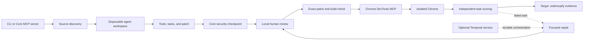

# WebMCPify Core architecture

Core is a local CLI and MCP server. It turns discovered application behavior into a reviewable source patch, applies only an exact human-approved patch, and verifies the live result independently.

## Runtime boundaries

- The target checkout is read during discovery and changed only by `apply` after approval.
- Coding agents edit a disposable copy without the target's `.git`, `.webmcpify`, or `node_modules` contents.
- Selected entries from the target's installed dependencies are linked into the disposable workspace for typecheck/build validation; they are not copied into it.
- Browser agents receive the approved task and Chrome DevTools MCP tools, not target source access.
- The independent scorer evaluates each approved `verify` expression against fresh live-page state.
- Temporal stores workflow progress only for optional durable repair. It does not replace approval or verification.

## Entry points

| File | Responsibility |
| --- | --- |
| `src/cli.ts` | Defines commands, options, package version, and managed-browser wrappers. |
| `src/mcp/server.ts` | Exposes repository analysis, generation, approved apply, and browser testing over stdio MCP; confines paths to its starting workspace. |
| `src/temporal/worker.ts` | Starts the optional Temporal worker and loads activities. |

## Commands

| File | Responsibility |
| --- | --- |
| `src/commands/run.ts` | Runs the normal discover → draft → review → apply → test → verify path. |
| `src/commands/discover.ts` | CLI wrapper for static project discovery. |
| `src/commands/generate.ts` | Creates a disposable workspace, invokes a provider, validates its source changes, and stores a pending proposal. |
| `src/commands/security.ts` | Audits proposed or approved tools and writes the project security report. |
| `src/commands/review.ts` | Serves the local two-step tool, task, and patch approval UI. |
| `src/commands/apply.ts` | Validates approval/source identity, applies the patch, runs target checks, and rolls back failure. |
| `src/commands/test.ts` | Runs approved tasks through the live browser and records independent results. |
| `src/commands/eval.ts` | Prints the latest project-scoped WebMCP test result. |
| `src/commands/repair.ts` | Drafts a focused patch from failed task evidence; optionally starts a Temporal workflow. |
| `src/commands/baseline.ts` | Measures the same approved tasks against the existing interface for comparison. |
| `src/commands/final-eval.ts` | Coordinates baseline, WebMCP, optional repair, Temporal comparison, checkpoints, and final evidence. |

## Core libraries

| File | Responsibility |
| --- | --- |
| `src/lib/discovery.ts` | Detects stack, routes, forms, actions, APIs, auth, state, and existing WebMCP signals. |
| `src/lib/agent-workspace.ts` | Copies a target into a temporary Git workspace, captures its real diff, and removes it. |
| `src/lib/agent.ts` | Normalizes provider invocation, MCP configuration, timeouts, output capture, and process cleanup. |
| `src/lib/claude.ts` | Implements the Claude-specific provider invocation. |
| `src/lib/ai-provider.ts` | Validates a selected provider or detects an installed provider CLI. |
| `src/lib/executables.ts` | Resolves provider executables from `PATH`, optional overrides, or the Codex editor installation. |
| `src/lib/prompts.ts` | Holds deterministic discovery, placement, proposal, and task-authoring instructions. |
| `src/lib/webmcp-spec-guidance.ts` | Holds the WebMCP compatibility, lifecycle, privacy, and security rules supplied to providers. |
| `src/lib/tool-proposals.ts` | Parses, normalizes, validates, persists, and reloads structured tool proposals. |
| `src/lib/security-audit.ts` | Checks declared user/agent binding, backend authorization, origins, quotas, replay protection, sensitive inputs, and schema bounds. |
| `src/lib/task-verification.ts` | Checks task verification expressions for unsafe or invalid patterns. |
| `src/lib/tasks.ts` | Validates 5–6 tasks, fingerprints them, and atomically binds them to approval. |
| `src/lib/patches.ts` | Extracts safe Git patches, validates paths and source state, and stores patch metadata. |
| `src/lib/preflight.ts` | Runs target typecheck/build inside the disposable workspace before review. |
| `src/lib/mcp-config.ts` | Reuses or safely merges user MCP configuration with Core's pinned Chrome DevTools MCP bridge. |
| `src/lib/browser.ts` | Reuses configured CDP or starts and cleans an isolated WebMCP-enabled Chrome process. |
| `src/lib/scoring.ts` | Creates isolated pages, checks the WebMCP runtime, evaluates tasks, and closes CDP. |
| `src/lib/target-url.ts` | Normalizes target URLs and checks reachability. |
| `src/lib/trajectories.ts` | Stores project-scoped run output and evidence under `.webmcpify/trajectories`. |
| `src/lib/config.ts` | Resolves optional feature flags such as durable repair. |
| `src/lib/temporal.ts` | Lazily loads optional Temporal packages with a clear installation error. |
| `src/lib/load-env.ts` | Loads optional Core development settings without importing the target application's `.env` secrets. |
| `src/lib/package-info.ts` | Reads the installed package name and version. |
| `src/lib/paths.ts` | Resolves the installed package root independently of the current directory. |
| `src/lib/eval.ts` | Keeps the former scoring import path compatible. |

## Temporal files

| File | Responsibility |
| --- | --- |
| `src/temporal/workflows.ts` | Defines the retry loop: test, draft repair, wait for review, apply, and retest. |
| `src/temporal/activities.ts` | Adapts existing Core command functions into Temporal activities. |
| `src/temporal/worker.ts` | Connects those workflows and activities to the configured task queue. |

## Verification and build files

| File | Responsibility |
| --- | --- |
| `scripts/clean.mjs` | Removes `dist` before compilation so stale modules cannot ship. |
| `scripts/verify-mcp.mjs` | Tests MCP identity, tools, workspace confinement, and browser MCP config merging. |
| `scripts/verify-discovery.mjs` | Tests framework, route, action, API, and WebMCP discovery with a temporary fixture. |
| `scripts/verify-tool-proposals.mjs` | Tests structured proposal parsing and grounding. |
| `scripts/verify-security-audit.mjs` | Tests pass/block decisions for consequential access-control contracts. |
| `scripts/verify-review.mjs` | Tests approval editing, confirmation, persistence, locking, and rejection. |
| `scripts/verify-patch-lifecycle.mjs` | Tests patch validation, approval gating, apply, and rollback. |
| `scripts/verify-repair.mjs` | Tests failure selection, focused repair patches, review boundaries, and regression evidence. |
| `scripts/verify-evaluation.mjs` | Tests shared task identity and project-scoped evaluation lookup. |
| `scripts/verify-final-eval.mjs` | Tests orchestration order, task-set consistency, and new-file diff capture. |
| `package.json` | Defines package metadata, commands, runtime dependencies, optional Temporal peers, tests, and publish contents. |
| `pnpm-lock.yaml` | Locks the development dependency graph. |
| `pnpm-workspace.yaml` | Defines approved dependency build scripts and the patched development resolution. |
| `tsconfig.json` | Compiles `src` to ESM in `dist`. |
| `.env.example` | Documents optional runtime overrides; no `.env` is required. |
| `.gitignore` | Excludes secrets, builds, local Core state, and generated evidence. |
| `README.md` | Provides the short product and usage guide. |
| `CONTRIBUTING.md` | Defines the pull-request, verification, security-reporting, and release process. |
| `CHANGELOG.md` | Records user-visible changes and verification claims. |
| `LICENSE` | Contains the MIT license. |

`dist/` is generated by TypeScript and published to npm. Do not edit it directly.

## Target-owned artifacts

Core writes these only inside the selected target project:

| Artifact | Purpose |
| --- | --- |
| `.webmcpify/discovery.json` | Static project map used as generation evidence. |
| `.webmcpify/proposed-tools.json` | Validated structured tool proposal. |
| `.webmcpify/pending-diff.patch` and `.meta.json` | Exact pending patch and its source identity/status. |
| `.webmcpify/approved-tools.json` | Human-approved tool/task manifest and fingerprint. |
| `.webmcpify/security-report.json` | Static Core access-control report shown before approval. |
| `tasks.json` | Approved browser-verifiable task set. |
| `.webmcpify/chrome-devtools-mcp.json` | Generated/merged browser MCP config when the target config is incomplete. |
| `.webmcpify/trajectories/` | Provider output, evaluations, and audit evidence. |
| `.webmcpify/rollback/` | Temporary snapshots used while applying a patch. |
| `.webmcpify/stale/` | Previous approval state invalidated by a new generation. |
| `.webmcpify/final-eval-state.json` | Resume checkpoint for advanced final evaluation. |
