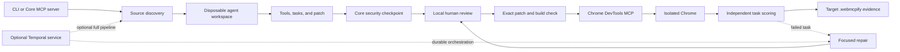

# WebMCPify Core architecture

Core is a local CLI and MCP server. It turns discovered application behavior into a reviewable source patch, applies only an exact human-approved patch, and verifies the live result independently.

```mermaid
flowchart LR
    CLI[CLI or Core MCP server] --> Discover[Source discovery]
    Discover --> Workspace[Disposable agent workspace]
    Workspace --> Proposal[Tools, tasks, and patch]
    Proposal --> Security[Core security checkpoint]
    Security --> Review[Local human review]
    Review --> Apply[Exact patch and build check]
    Apply --> Bridge[Chrome DevTools MCP]
    Bridge --> Browser[Isolated Chrome]
    Browser --> Verify[Independent task scoring]
    Verify --> Evidence[Target .webmcpify evidence]
    Verify -. failed task .-> Repair[Focused repair]
    Repair --> Review
    Temporal[Optional Temporal service] -. durable orchestration .-> Repair
    Temporal -. optional full pipeline .-> Discover
```

## Runtime boundaries

- The target checkout is read during discovery and changed only by `apply` after approval. Git validates/applies the same in-memory approved patch bytes through stdin, never reopening the mutable pending path after hash validation.
- Coding agents edit a disposable copy of the saved working tree, including uncommitted/untracked files, without the target's `.git`, `.webmcpify`, `.serena`, `node_modules`, or `.pnpm-store` contents. Copying requests optional filesystem reflinks with ordinary-copy fallback, never source hard links; no new asset/cache exclusions are inferred from Git ignore rules. Canonical target roots and internal file/directory symlinks stay inside the snapshot; external source links are refused with common-root guidance. Nested/force-staged dependency and agent state cannot enter captured patches.
- Selected entries from the target's installed dependencies are linked into the disposable workspace for typecheck/build validation; they are not copied into it.
- Generation preflight and approved apply disable pnpm's automatic before-run installation. Dependency installation remains explicit; source rollback cannot restore arbitrary dependency-tree or build-script side effects.
- High-impact names alone do not turn a source-backed demo store action into a purchase. A narrowly recognized local Zustand setter can receive a human scope-review notice; unknown calls, custom storage/on-set callbacks, shadowed factories, and external source paths retain consequential checks. Generation inspects its validated workspace; review reconstructs supported exact pending text hunks only in memory, never borrowing an old local handler's classification for a changed backend action. This is not general effect analysis or deployed-runtime proof.
- Browser agents receive empty disposable workspaces, not copied source. Each task uses a fresh browser context and independent scoring of the exact acted-on page. Non-Claude adapters do not enforce the requested tool allowlist as an OS sandbox. See the [runtime audit](docs/audits/2026-10-01-runtime-compatibility.md).
- Core owns the real Chrome DevTools MCP connection and binds the task tab by a unique marker. Its authenticated, task-scoped stdio gateway exposes only `list_webmcp_tools` and `call_webmcp_tool` (delegating to upstream `execute_webmcp_tool`), rejects unapproved tools/routing/scripts, and records execution independently of provider reports. Agent access is revoked and pending calls settle before scoring. The UI baseline is intentionally separate.
- The independent scorer evaluates each approved `verify` expression against fresh live-page state.
- WebMCP scoring requires actual discovery and ordered required calls before considering postconditions. Rejection tests need one matching recorded business error and an unchanged-state postcondition, including a bounded 500 ms settle window; protocol/browser errors cannot pass. Individual verification reads have deadlines and respect cancellation. Infrastructure/evidence/verifier failures do not authorize application repair, including durable task attempts.
- Core waits briefly for matching guard exceptions arriving on its separate CDP observer after the MCP response; it never retries the capability to recover an error. A timed-out MCP request closes the owned connection to avoid overlapping uncertain executions.
- Failed standalone audits exit nonzero; failed baseline providers cannot pass initially-true checks. Applied repairs report awaiting-test until actual actions are replayed. Final-eval caches must match execution policy, URL/provider, the exact complete task/result set, and current local Git source identity for WebMCP; baselines must be UI-only and intentionally describe pre-apply source.
- Temporal is lazily loaded only for durable run/repair or advanced final evaluation. `run --durable` checkpoints discovery, generation/preflight, security, initial human review, optional pre-apply UI baseline, exact-source apply, each approved browser task, and evaluation. Initial review permits tool deselection; repair reviews preserve already-approved criteria. It does not replace approval or verification.
- Durable repair resolves and records the initiating client's canonical provider so a worker default cannot silently select another coding agent. Only the worker launches its browser; explicit/environment durable selection is resolved before client-side Chrome setup, while plain repair retains its browser path.
- Durable activity results carry draft/task/source identities and bounded scores, not generated source, verification expressions or raw provider output. Product-context input is recorded in history and must not contain secrets. Each activity heartbeats, has a local deadline and propagates cancellation; owned validation subprocess trees stop before rollback finishes. Side-effecting activities are not automatically retried. Completed checkpoints can resume after worker restart; arbitrary in-flight crashes remain a fail-closed recovery boundary.
- Provider and durable CLI failures offer fixed-text model-access, quota, authentication, connection and timeout guidance without printing raw error causes, prompts or code. Explicit terminal Codex/Claude failure envelopes fail even with a zero process exit. Durable failures include the recorded phase; completed-run reattachment reads history rather than rerunning source changes.

## Entry points

| File | Responsibility |
| --- | --- |
| `src/cli.ts` | Defines commands, options, package version, and managed-browser wrappers. |
| `src/mcp/server.ts` | Exposes repository analysis, generation, approved apply, and browser testing over stdio MCP; confines paths to its starting workspace. |
| `src/temporal/worker.ts` | Starts the optional Temporal worker and loads activities. |

## Commands

| File | Responsibility |
| --- | --- |
| `src/commands/run.ts` | Runs discover → draft → review → apply → test → verify, or lazily starts/reattaches the optional full Temporal pipeline. |
| `src/commands/discover.ts` | CLI wrapper for static project discovery. |
| `src/commands/generate.ts` | Creates a disposable workspace, invokes a provider, validates its source changes, and stores a pending proposal. |
| `src/commands/security.ts` | Audits proposed or approved tools and writes the project security report. |
| `src/commands/review.ts` | Serves tool-only selection with read-only contracts/tasks, asynchronous locked revision, and exact-patch two-step approval. |
| `src/commands/apply.ts` | Validates approval/source identity, applies the patch, runs target checks, and rolls back failure. |
| `src/commands/test.ts` | Runs approved tasks through the live browser and records independent results. |
| `src/commands/eval.ts` | Prints the latest project-scoped WebMCP test result. |
| `src/commands/repair.ts` | Drafts a focused patch from failed task evidence; optionally starts a Temporal workflow. |
| `src/commands/baseline.ts` | Measures the same approved tasks against the existing interface for comparison. |
| `src/commands/final-eval.ts` | Coordinates baseline, WebMCP, optional repair, Temporal comparison, checkpoints, and final evidence. |

## Core libraries

| File | Responsibility |
| --- | --- |
| `src/lib/discovery.ts` | Detects stack, routes, forms, actions, APIs, auth, state, and existing WebMCP signals without silent signal-count truncation. |
| `src/lib/action-inventory.ts` | Lazily parses JS/TS/JSX to inventory distinct event branches and named store actions; preserves unresolved references as hints and reports parse fallbacks. |
| `src/lib/capability-coverage.ts` | Reads labelled JSON or an unambiguous unlabelled JSON object/fence, normalizes source-grounded retained draft tools to proposed coverage, excludes unresolved hints, and accounts for resolved candidates through proposed/existing/skipped capabilities. Permits one report-only correction with source/tasks/tools retained and one source-capable completion for real gaps before normal validation/review. |
| `src/lib/agent-workspace.ts` | Copies a target into a temporary Git workspace, captures its real diff, and removes it. |
| `src/lib/agent-readiness.ts` | Merges target-root agent guides and public capability/crawler documentation into the same reviewed patch. |
| `src/lib/agent-discovery-content.ts` | Renders safe static HTML capability guidance and source-backed deployment/GEO/AEO checks without invented deployment URLs or indexing promises. |
| `src/lib/project-identity.ts` | Chooses a bounded project display name from discovery or the repository folder, shared by review and public guidance. |
| `src/lib/agent.ts` | Normalizes provider invocation, MCP configuration, timeouts, output capture, and process cleanup. |
| `src/lib/claude.ts` | Implements the Claude-specific provider invocation. |
| `src/lib/ai-provider.ts` | Validates a selected provider or detects an installed provider CLI. |
| `src/lib/executables.ts` | Resolves provider executables from `PATH`, optional overrides, standalone/editor Codex installations, and classifies launch failures without exposing raw diagnostics. |
| `src/lib/generation-metadata.ts` | Validates generated tools/tasks and permits one metadata-only correction with source/Git identity and valid-contract preservation checks. |
| `src/lib/review-selection.ts` | Revises a pending patch for selected tools in a disposable workspace, checks retained contracts/source/security, updates tasks/docs, and returns a new unapproved draft. |
| `src/lib/review-ui.ts` | Locks review controls immediately, polls revision progress, and automatically reopens a fresh draft. |
| `src/lib/review-files.ts` | Describes every actual patch path with change type and grounded file-role/tool-placement explanations. |
| `src/lib/cli-progress.ts` | Provides safe stderr-only phase activity with elapsed time and cleanup on success or failure. |
| `src/lib/canonical-json.ts` | Compares immutable JSON contracts without treating object-key order as a change. |
| `src/lib/prompts.ts` | Holds deterministic discovery, placement, proposal, and task-authoring instructions. |
| `src/lib/webmcp-spec-guidance.ts` | Holds the WebMCP compatibility, lifecycle, privacy, and security rules supplied to providers. |
| `src/lib/tool-proposals.ts` | Parses, normalizes, validates, persists, and reloads structured tool proposals. |
| `src/lib/security-audit.ts` | Checks declared user/agent binding, backend authorization, origins, quotas, replay protection, sensitive inputs, and schema bounds. |
| `src/lib/task-verification.ts` | Checks task verification expressions for unsafe or invalid patterns. |
| `src/lib/tasks.ts` | Validates uncapped task sets with a rounded-up 20% minimum margin (30% authoring target) over initial/retained tool count, enforces coverage, fingerprints them, and binds them to approval. Legacy approved task sets remain readable. |
| `src/lib/duplicate-imports.ts` | Removes identical repeated named imports only in changed disposable-workspace files before generation preflight; preserves conflicting bindings, type/value distinctions, comments and external source. |
| `src/lib/patches.ts` | Extracts safe Git patches, validates paths and source state, and stores patch metadata. |
| `src/lib/preflight.ts` | Runs target typecheck/build inside the disposable workspace before review. |
| `src/lib/package-manager.ts` | Chooses the target package manager and anchors its executable before changing workspace; environment launch failures do not trigger LLM source repair. |
| `src/lib/mcp-config.ts` | Reuses or safely merges user MCP configuration with Core's pinned Chrome DevTools MCP bridge. |
| `src/lib/mcp-stdio-client.ts` | Bounded JSONL MCP client with private diagnostics, startup checks, deadlines, cancellation and process cleanup. |
| `src/lib/webmcp-task-bridge.ts` | Connects real Chrome MCP; binds isolated task tabs and enforces/records the two-method WebMCP gateway. |
| `src/mcp/webmcp-bridge.ts` | Thin stdio adapter to Core's authenticated loopback task endpoint; no direct browser access. |
| `src/lib/webmcp-evidence.ts` | Core-owned discovery/call/error evidence, not parsed provider claims. |
| `src/lib/webmcp-observer.ts` | Read-only CDP observer correlated by invocation/tool/input, preserving thrown guard messages omitted by upstream MCP without calling capabilities itself. |
| `src/lib/browser.ts` | Reuses configured CDP or starts and cleans an isolated WebMCP-enabled Chrome process. |
| `src/lib/scoring.ts` | Creates isolated pages, checks the WebMCP runtime, evaluates tasks, and closes CDP. |
| `src/lib/target-url.ts` | Normalizes target URLs and checks reachability. |
| `src/lib/trajectories.ts` | Stores project-scoped run output and evidence under `.webmcpify/trajectories`. |
| `src/lib/config.ts` | Resolves optional feature flags such as durable repair. |
| `src/lib/temporal.ts` | Lazily loads optional Temporal packages with a clear installation error. |
| `src/lib/durable-run.ts` | Starts one active pipeline per canonical target; validates deadlines, pins reattachment to an execution and reports live phases/review URLs. |
| `src/lib/operation-context.ts` | Carries cancellation and remaining durable activity deadlines without changing normal command defaults. |
| `src/lib/operation-command.ts` | Owns validation process trees and terminates them before cancellation/rollback can return. |
| `src/lib/load-env.ts` | Loads optional Core development settings without importing the target application's `.env` secrets. |
| `src/lib/package-info.ts` | Reads the installed package name and version. |
| `src/lib/paths.ts` | Resolves the installed package root independently of the current directory. |
| `src/lib/eval.ts` | Keeps the former scoring import path compatible. |

## Temporal files

| File | Responsibility |
| --- | --- |
| `src/temporal/contracts.ts` | Data-only full-pipeline options, draft/source identities, progress and results. |
| `src/temporal/workflows.ts` | Defines the full pipeline and bounded repair loop; versions changed repair activity options for old-history replay. |
| `src/temporal/activities.ts` | Adapts targeted repair commands into activities with fixed task and exact patch identities. |
| `src/temporal/pipeline-activities.ts` | Adapts full-pipeline commands; rejects draft, policy, task or source drift between stages and records every approved task. |
| `src/temporal/activity-context.ts` | Heartbeats, local deadlines, cancellation cleanup and actual review-URL reporting. |
| `src/temporal/worker.ts` | Connects workflows/activities to the configured queue; serializes activity execution to protect shared browser/draft state. |

## Verification and build files

| File | Responsibility |
| --- | --- |
| `scripts/clean.mjs` | Removes `dist` before compilation so stale modules cannot ship. |
| `scripts/verify-mcp.mjs` | Tests MCP identity, tools, workspace confinement, and browser MCP config merging. |
| `scripts/verify-discovery.mjs` | Tests framework, route, action, API, and WebMCP discovery with a temporary fixture. |
| `scripts/verify-capability-coverage.mjs` | Tests seven distinct actions including conditional login/logout, ten verification tasks, bounded gap completion, omission evidence, immutable existing contracts, and unchanged target source. |
| `scripts/verify-coverage-report.mjs` | Checks the metadata-to-coverage handoff, fenced/plain report handling, bounded report-only correction, retained source/contracts/tasks and refusal of invalid reports or source/Git drift without browser or build execution. |
| `scripts/verify-tool-proposals.mjs` | Tests structured proposal parsing and grounding. |
| `scripts/verify-agent-invocation.mjs` | Tests provider invocation, executable paths, safe launch diagnostics, and terminal redaction. |
| `scripts/verify-generation-recovery.mjs` | Exercises generation metadata recovery and fail-closed source/contract checks using credential-free providers in disposable repositories. |
| `scripts/verify-workspace-copy.mjs` | Tests optional-reflink/ordinary copying, saved dirty/staged/untracked/required-ignored files, binary assets, nested exclusions, unchanged original contents/Git state, and copy-error cleanup. |
| `scripts/verify-browser-state.mjs` | Tests real Chrome same-tab scoring, retained task state, expected-error matching, forbidden-state rejection, and personal-context preservation. |
| `scripts/verify-webmcp-execution.mjs` | Tests mandatory MCP startup, authenticated two-method gateway, approved-only execution, real rejection records, null-safe checks and false-pass prevention without a live model. |
| `scripts/verify-webmcp-browser.mjs` | Tests real pinned Chrome MCP and consecutive isolated WebMCP tasks, asynchronous state, absent-storage rejection, same-tool setup and durable-task/connection-failure boundaries with a fixture provider. |
| `scripts/verify-security-audit.mjs` | Tests pass/block decisions for consequential access-control contracts. |
| `scripts/verify-review.mjs` | Tests read-only tasks/contracts, tamper rejection, confirmation, persistence, cancellation, and rejection. |
| `scripts/verify-partial-review.mjs` | Tests removal of rejected registrations, retained-only contracts/tasks/docs, preserved original app actions, fresh patch confirmation, and refused unsafe revisions. |
| `scripts/verify-review-browser.mjs` | Tests real Chrome review locking across tabs/refreshes, automatic reopen, repeated removal, and final confirmation. |
| `scripts/verify-patch-lifecycle.mjs` | Tests patch validation, approval gating, apply, and rollback. |
| `scripts/verify-optional-temporal.mjs` | Tests isolated production CLI/MCP startup without optional peers and clear durable/worker installation messages. |
| `scripts/verify-temporal-contracts.mjs` | Tests exact patch/policy/task/source guards, timeout bounds and uncapped ordered evaluation. |
| `scripts/verify-temporal-live.mjs` | Opt-in isolated real Temporal test for ordered stages, heartbeats, cancellation, completed-stage restart and current/legacy history replay. |
| `scripts/verify-temporal-pipeline.mjs` | Opt-in real Core CLI/worker/Temporal/Chrome pipeline on a disposable JS app, with credential-free provider, baseline, expected rejection, subset revision and reattachment. |
| `scripts/verify-repair.mjs` | Tests failure selection, focused repair patches, review boundaries, and regression evidence. |
| `scripts/verify-evaluation.mjs` | Tests shared task identity and project-scoped evaluation lookup. |
| `scripts/verify-final-eval.mjs` | Tests orchestration order, task-set consistency, and new-file diff capture. |
| `package.json` | Defines package metadata, commands, runtime dependencies, optional Temporal peers, tests, and publish contents. |
| `pnpm-lock.yaml` | Locks the development dependency graph. |
| `pnpm-workspace.yaml` | Defines approved dependency build scripts and the patched development resolution. |
| `tsconfig.json` | Compiles `src` to ESM in `dist`. |
| `.env.example` | Documents optional runtime overrides; no `.env` is required. |
| `.gitignore` | Excludes secrets, builds, local Core state, and generated evidence. |
| `README.md` | Provides the short product and usage guide. |
| `CONTRIBUTING.md` | Defines the pull-request, verification, security-reporting, and release process. |
| `CHANGELOG.md` | Records user-visible changes and verification claims. |
| `LICENSE` | Contains the MIT license. |

`dist/` is generated by TypeScript and published to npm. Do not edit it directly.

## Target-owned artifacts

Core writes these only inside the selected target project:

| Artifact | Purpose |
| --- | --- |
| `.webmcpify/discovery.json` | Static project map used as generation evidence. |
| `.webmcpify/proposed-tools.json` | Validated structured tool proposal. |
| `.webmcpify/pending-diff.patch` and `.meta.json` | Exact pending patch and its source identity/status. |
| `.webmcpify/approved-tools.json` | Human-approved tool/task manifest and fingerprint. |
| `.webmcpify/security-report.json` | Static Core access-control report shown before approval. |
| `tasks.json` | Approved browser-verifiable task set. |
| `.webmcpify/chrome-devtools-mcp.json` | Generated/merged browser MCP config when the target config is incomplete. |
| `.webmcpify/trajectories/` | Provider output, evaluations, and audit evidence. |
| `.webmcpify/rollback/` | Temporary snapshots used while applying a patch. |
| `.webmcpify/stale/` | Previous approval state invalidated by a new generation. |
| `.webmcpify/final-eval-state.json` | Resume checkpoint for advanced final evaluation. |
| `AGENTS.md` | One reviewed guide combining repository-maintenance and detailed site-capability instructions; separate from private run state. |
| Served `llms.txt`, `webmcp.md`, and `robots.txt` | Reviewed public discovery guidance and scoped metadata crawler policy; deployment location is framework-dependent. |
